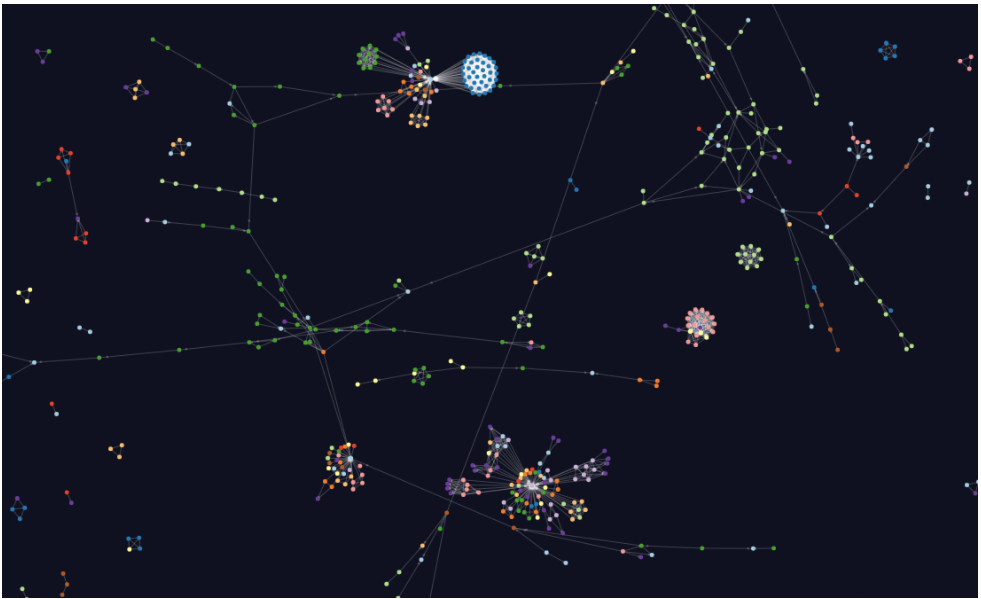
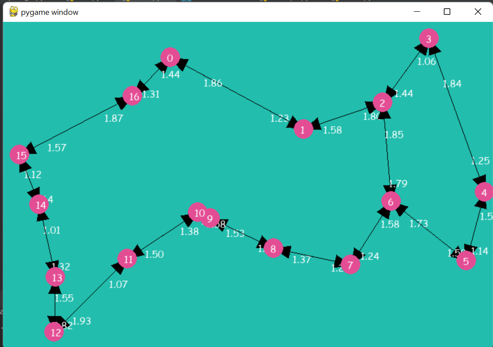
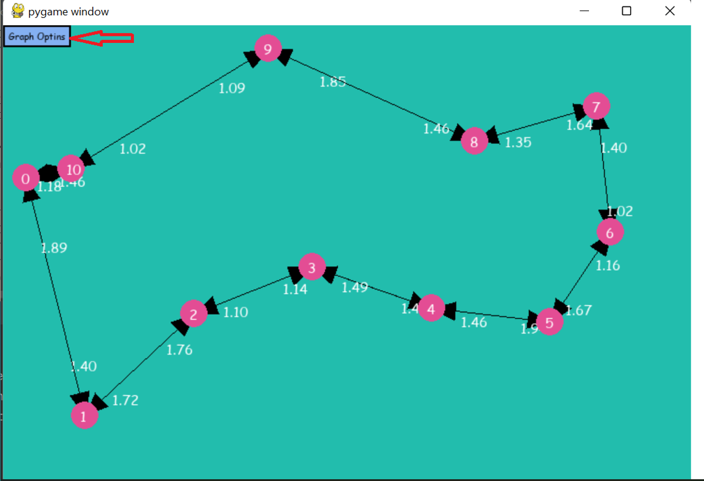
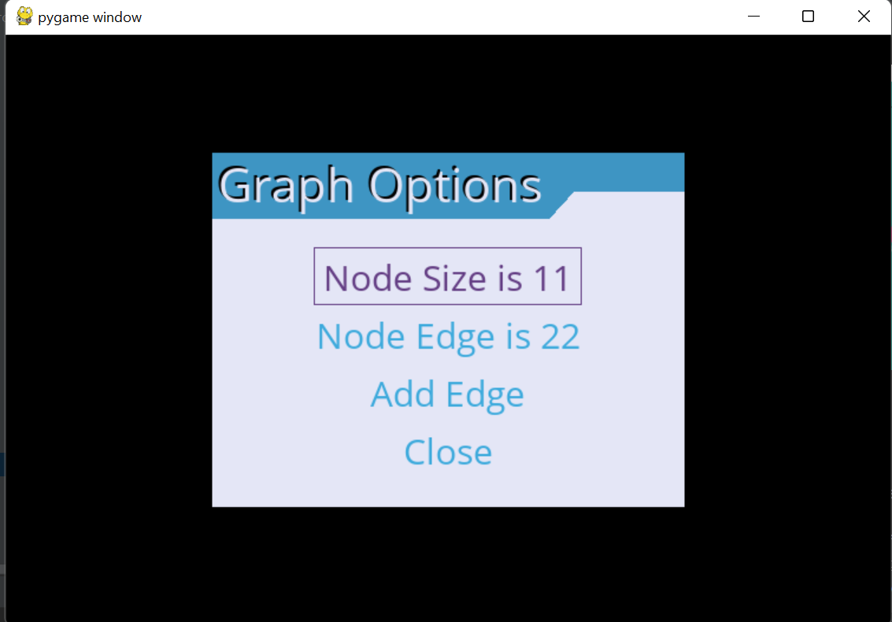
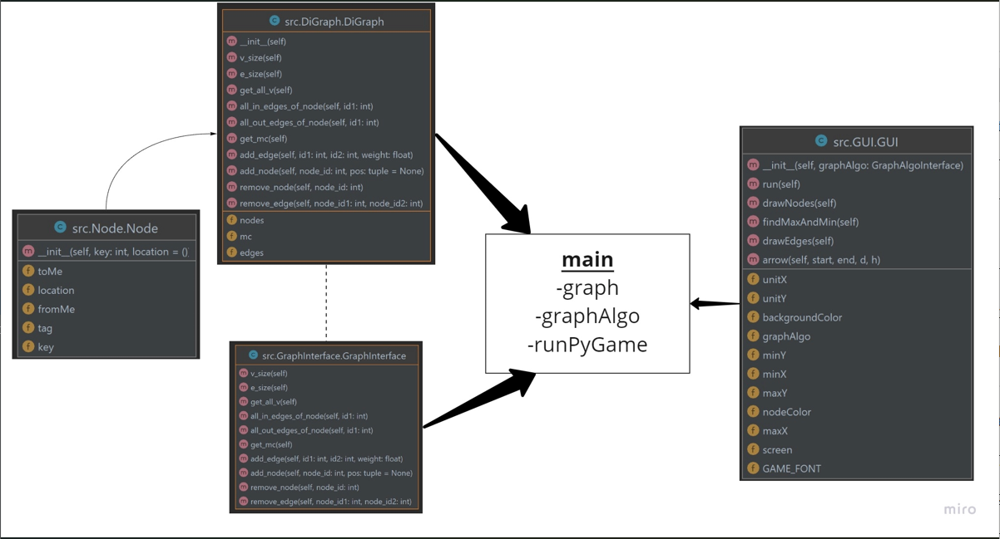
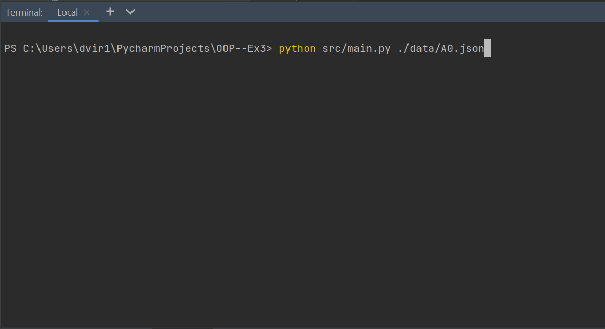

# OOP--Ex3

# Making a Directed Graph
  

### In this assignment we were asked to program a directed Graph,checking Properties about it with some algorithms and draw it with Gui. 

# Input Files  
To make the graph running, the program need to get input about the verticals, and the edges the graph contains.

- we get from the consumer interfaces of the Graph, vertical data, Coordinate position of vertical, edge properties and algorithms of the graph .
- this information imported to the program with Json FIle, verticals named: "Nodes" and edges named:"Edges".
<photo>

# our code  
The main idea was to use the exclusive id that every node have and to access him with complexity if o(1) with dictionary. 
The graph will save all the relevant data about each vertical and edge in the graph, so we can check some algorithm with a better complexity.

## classes  
1. **DiGraph** - contains dictionary of all the nodes in the graph(Node) and all the edges() and the mc(changing in the graph).
     
2. **GraphAlgo** - this class get DiGraph and can calculate the next list of algorithms:
- A shorted path between 2 verticals.
- The ideal center of the graph.
- Tsp problem for a group of verticals in the graph
- load graph from json file.
- save the graph to new json file.
- plot the graph(crate visual display of the graph(GUI)).
   
3. **Node** - this class save information about each vertical:
   - its exclusive id.
   - location information.
   - tag(using for the algorithms).
   - dictionary for all the edges from this node to another.
   - dictionary for all the edges that getting to this node.                
      
   
 
## Gui  
This classes generate a windows that show the graph with all its properties. 
<photo>
you can load to the graph with Json file that define the verticals and edges of the graph, and it will load and show it on the screen.
 

on the window we have buttons of two different subjects we can use on the graph:
- Graph algorithm buttons
- changing Graph Properties buttons
 

## Algorithms 

The algorithms we execute:

- **shortest_path** - this algorithm check what is the best lower wight we can spend to arrive from a vertex to another one (if they are connect).
  we use Dijkstra algorithm to find the wight and using Dynamic programing to save already all the wights from this node to the another connect one.   
- **Dijkstra** - this algorithm get src to check the path from it to all other nodes. first it checks if the List off values is exist and updated. if isn't we run the algorithem and save the stations that represent the shortest path between each node from our src input.  
- **centerPoint** - find the Node on the graph that will arrive fastest to the most distance from him.  
we're doing Dijkstra on each node and save the max distance from it. then we check the node with the lowest max weight.   

- **Tsp** - will find the best way to do circle on group of nodes in the graph. 
  this solution algorithm will be in factorial complicity Time and can't be calculated for more to 15 nodes.  
  then we execute a greedy algorithm that check the nearest next node from my current node.
  i am saving the permutation for each starting node and find the node that will be the best to start from.
  for finding the lowest weight between all two nodes in the group, we need to run Dijkstra to this node (if it never calculate it yet).
  
## UML Diagram  

## Algorithms Results 
  
## how to run the program  

1. Download The project from the here.  
2. open the folder of the project and run terminal from this address  
3. write this Line in the terminal command:  

> python src/main.py ./data/A0.json

---------------------------------------^ 
Here you fill the path for your json file.

example of Graph Json file you can find in the [data folder](https://github.com/dvirGev/OOP--Ex3/tree/main/data)   
   
if you want to watch the defferance between the run times of the algorithms in java and python open the link. 
https://github.com/dvirGev/OOP--Ex3/wiki/comper-between-python-and-java

